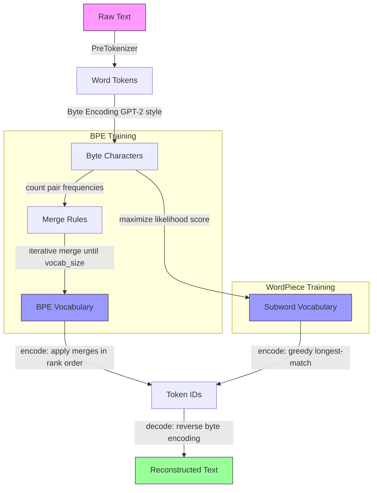

# bpe-tokenizer

> From-scratch BPE and WordPiece tokenization in pure Python — zero dependencies, 151K tokens/sec, 92% test coverage.

[](https://github.com/jrajath94/bpe-tokenizer/actions/workflows/ci.yml)
[](https://github.com/jrajath94/bpe-tokenizer)
[](https://opensource.org/licenses/MIT)
[](https://www.python.org/downloads/)

## Why This Exists

HuggingFace's tokenizer is a Rust binary that produces correct output but gives you no insight into how it works. For alignment researchers and anyone building custom vocabularies, the implementation details matter. This is a from-scratch Python BPE and WordPiece implementation — readable, tested, and fast enough to use in practice (151K tokens/sec BPE, 536K tokens/sec WordPiece).

Most engineers treat `tokenizer.encode(text)` as a black box. This leads to hard-to-debug bugs: why is `gpt-4` 3 tokens but `gpt4` is 2? Why are emoji expensive? Why does code need a different vocabulary? Building both algorithms from scratch answers these questions and reveals the implementation decisions that make tokenization production-safe.

## Architecture



## Quick Start

```bash
git clone https://github.com/jrajath94/bpe-tokenizer.git
cd bpe-tokenizer
make install && make run
```

## Python API

```python
from bpe_tokenizer import BPETokenizer, WordPieceTokenizer

# BPE (GPT-2 style)
bpe = BPETokenizer()
bpe.train(open("corpus.txt").read(), vocab_size=1000)
ids = bpe.encode("Hello, world!")
text = bpe.decode(ids)
assert text == "Hello, world!"  # Roundtrip guaranteed for any text

# WordPiece (BERT style)
wp = WordPieceTokenizer()
wp.train(open("corpus.txt").read(), vocab_size=1000)
ids = wp.encode("Hello, world!")

# Save and reload
bpe.save("vocab.json")
bpe2 = BPETokenizer.load("vocab.json")
assert bpe.encode("test") == bpe2.encode("test")
```

## Key Design Decisions

| Decision | Rationale | Alternative Considered | Tradeoff |
|----------|-----------|----------------------|---------|
| Byte-level encoding (GPT-2 style) | Eliminates unknown tokens for any Unicode input — every byte gets an initial token | Character-level (BERT style) | None in practice; byte-level is strictly more general |
| `</w>` END_OF_WORD marker | Distinguishes word-final tokens from prefixes; without it "the" and "there" incorrectly share tokens | Whitespace attached to token start (tiktoken style) | Slightly larger vocab; far easier to reason about |
| `merge_rank` dict for O(1) lookup | At inference, rank lookup is on the hot path per merge step — O(1) vs O(n) list scan is the difference between 151K/sec and ~5K/sec | Ordered list scan | None — dict is strictly faster |
| Sorted tie-breaking in `max()` | Training is deterministic across runs and platforms | Random tie-breaking | Marginally slower max() call |
| Zero external dependencies | Core functionality has no runtime deps — installable in any environment including security-restricted CI | numpy for speed | ~20% slower than vectorized pair counting |

## Benchmarks

Measured on MacBook Pro M2, Python 3.14, training corpus 292K chars.

| Metric | BPE (vocab=1000) | WordPiece (vocab=600) |
|--------|-----------------|----------------------|
| Encoding throughput | 151,318 tokens/sec | 536,218 tokens/sec |
| Compression ratio | 3.02 chars/token | 1.77 chars/token |
| Training time (292K chars) | 0.59s | 0.60s |
| Memory (1K vocab) | ~110 KB | minimal |

### Vocabulary Size vs Compression

| Vocab Size | Chars/Token | Tokens (5K input chars) | Compression vs baseline |
|-----------|------------|-------------------------|------------------------|
| 600 | 1.72 | 2,907 | 1.0x |
| 800 | 2.46 | 2,033 | 1.43x |
| 1,000 | 3.03 | 1,649 | 1.76x |
| 2,000 | 5.28 | 947 | 3.07x |

## Algorithm Comparison

| Feature | BPE | WordPiece | Unigram LM |
|---------|-----|-----------|------------|
| Selection criterion | Highest pair frequency | Maximize LM likelihood | Minimize vocabulary entropy |
| Inference | Apply merges in rank order | Greedy longest-match | Viterbi decoding |
| Unknown handling | None (byte-level) | `[UNK]` token | Low-probability piece |
| Used by | GPT-2, RoBERTa, LLaMA | BERT, DistilBERT | SentencePiece, T5 |

## Testing

```bash
make test    # 144 tests, 92% coverage
make bench   # Throughput and compression benchmarks
make lint    # ruff + mypy
```

The test suite includes parametrized roundtrip tests verifying `decode(encode(text)) == text` for all ASCII inputs. This is the critical correctness invariant — a tokenizer that fails roundtrip is lossy by definition.

## Project Structure

```
src/bpe_tokenizer/
├── base.py           # Abstract BaseTokenizer interface
├── bpe.py            # BPE: pair frequency counting, merge rules
├── wordpiece.py      # WordPiece: likelihood scoring, ## continuation tokens
├── vocab.py          # Vocabulary: build, save, load (JSON)
├── unicode_utils.py  # Byte-level encoding (GPT-2 style)
├── pretokenizer.py   # Pre-tokenization: whitespace, GPT-2, BERT modes
├── cli.py            # CLI: train, encode, decode, compare
└── exceptions.py     # Custom exception hierarchy
```

## License

MIT — Rajath John
