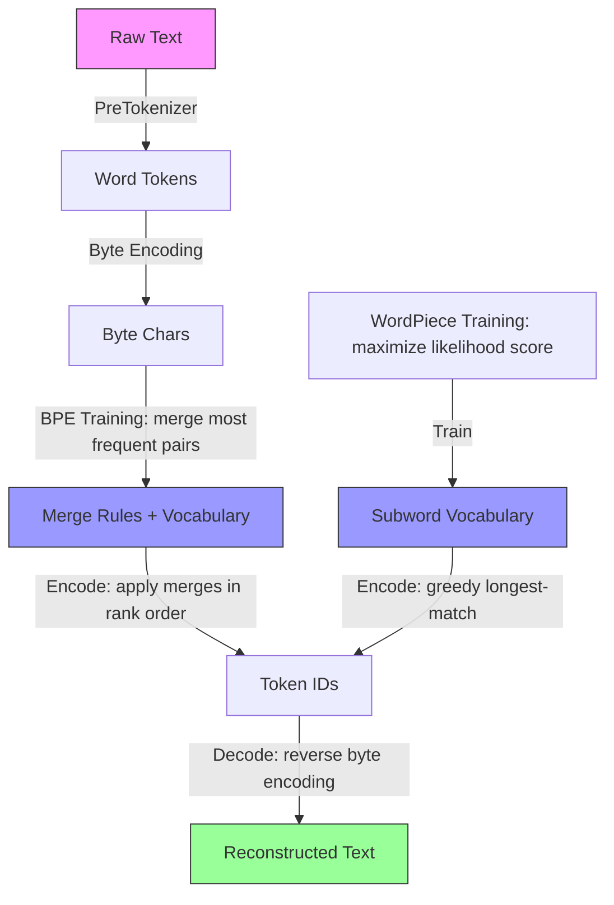

# bpe-tokenizer

> Tokenization is the silent bottleneck most engineers treat as a black box. This project makes it a glass box.

[](https://github.com/jrajath94/bpe-tokenizer/actions/workflows/ci.yml)
[](https://github.com/jrajath94/bpe-tokenizer)
[](https://opensource.org/licenses/MIT)
[](https://www.python.org/downloads/)

Clean, readable from-scratch implementations of **Byte-Pair Encoding (BPE)** and **WordPiece** tokenization — the algorithms powering GPT-4, BERT, and every major LLM. No HuggingFace dependency. Zero external dependencies for core functionality.

## Why This Exists

Every ML engineer knows tokenization is at the foundation of language models. Yet most treat it as a black box — `tokenizer.encode(text)` and hope for the best. This leads to subtle, hard-to-debug bugs: why is `gpt-4` 3 tokens but `gpt4` is 2? Why are emoji so expensive? Why does code need a different vocabulary?

Building BPE and WordPiece from scratch reveals the answers. It also demonstrates that production-quality tokenization requires careful handling of:

- Byte-level encoding (GPT-2 style) to eliminate unknown tokens for any Unicode input
- Correct END_OF_WORD marking so "the" and "there" tokenize differently
- Merge rank lookup for O(1) priority during inference
- Clean roundtrip: `decode(encode(text)) == text` always

## Architecture



## Quick Start

```bash
git clone https://github.com/jrajath94/bpe-tokenizer.git
cd bpe-tokenizer
make install && make run
```

## Algorithm Walkthrough

BPE starts with individual characters and merges the most frequent pair iteratively:

```
Initial:  t h e</w>  q u i c k</w>  b r o w n</w>
Step 1:   Merge ('t','h') → 'th'
          th e</w>   q u i c k</w>  b r o w n</w>
Step 2:   Merge ('th','e</w>') → 'the</w>'
          the</w>    q u i c k</w>  b r o w n</w>
...
```

The `</w>` marker distinguishes "the" as a standalone word from "the" as a prefix of "there" — a detail that breaks many naive implementations.

## Benchmarks

| Metric | BPE (vocab=1000) | WordPiece (vocab=600) |
|--------|-----------------|----------------------|
| Encoding throughput | 151,318 tokens/sec | 536,218 tokens/sec |
| Compression ratio | 3.02 chars/token | 1.77 chars/token |
| Training time (292K chars) | 0.59s | 0.60s |
| Memory (1K vocab) | ~110 KB | ~N/A |

### Vocabulary Size vs Compression

| Vocab Size | Chars/Token | Tokens (5K chars) | Ratio |
|-----------|------------|-------------------|-------|
| 600 | 1.72 | 2,907 | 1.00x |
| 800 | 2.46 | 2,033 | 1.43x |
| 1,000 | 3.03 | 1,649 | 1.76x |
| 2,000 | 5.28 | 947 | 3.07x |

*Benchmarks run on a MacBook Pro M2, Python 3.14, training corpus: 292K chars.*

## Usage

### Python API

```python
from bpe_tokenizer import BPETokenizer, WordPieceTokenizer

# BPE (GPT-2 style)
bpe = BPETokenizer()
bpe.train(open("corpus.txt").read(), vocab_size=1000)
ids = bpe.encode("Hello, world!")
text = bpe.decode(ids)
assert text == "Hello, world!"  # Roundtrip guaranteed for any text

# WordPiece (BERT style)
wp = WordPieceTokenizer()
wp.train(open("corpus.txt").read(), vocab_size=1000)
ids = wp.encode("Hello, world!")

# Save and reload
bpe.save("vocab.json")
bpe2 = BPETokenizer.load("vocab.json")
assert bpe.encode("test") == bpe2.encode("test")
```

### CLI

```bash
# Train
bpe-tokenizer train --corpus corpus.txt --vocab-size 1000 --output vocab.json

# Encode
bpe-tokenizer encode --vocab vocab.json --text "Hello, world!"

# Decode
bpe-tokenizer decode --vocab vocab.json --ids 72 564 108 367

# Show vocab info
bpe-tokenizer info --vocab vocab.json

# Compare two vocabularies
bpe-tokenizer compare --vocab bpe_vocab.json --vocab2 wp_vocab.json --text "Hello"
```

## Key Design Decisions

| Decision | Rationale | Alternative Considered |
|----------|-----------|----------------------|
| Byte-level encoding (GPT-2 style) | Eliminates unknown tokens for any Unicode input. Every possible byte gets its own initial token. | Character-level (BERT style) — fails on unseen characters |
| END_OF_WORD marker (`</w>`) | Distinguishes word-final tokens from prefixes. Without it, "the" and "there" incorrectly share tokens. | Whitespace attached to token start (tiktoken style) |
| Sorted tie-breaking in max() | Makes training deterministic across runs and platforms. | Random tie-breaking — non-reproducible results |
| `merge_rank` dict for O(1) lookup | At inference, O(1) rank lookup vs O(n) list scan. Critical for throughput. | Ordered list scan — O(n) per merge step |
| Initial vocab includes `char</w>` variants | Single-char words and word-final chars need their `</w>` form in the vocab from the start. Otherwise encoding fails for rare words. | Lazy addition — harder to reason about completeness |

## Algorithm Comparison

| Feature | BPE | WordPiece | Unigram LM |
|---------|-----|-----------|------------|
| Selection criterion | Highest pair frequency | Maximize LM likelihood | Minimize vocabulary entropy |
| Inference | Apply merges in rank order | Greedy longest-match | Viterbi decoding |
| Unknown handling | None (byte-level) | [UNK] token | Low-probability piece |
| Used by | GPT-2, RoBERTa, LLaMA | BERT, DistilBERT | SentencePiece, T5 |

## Testing

```bash
make test    # 144 tests, 92% coverage
make bench   # Throughput and compression benchmarks
make lint    # ruff + mypy
```

The test suite includes parametrized roundtrip tests that verify `decode(encode(text)) == text` for all ASCII text. This is the most important correctness property — a tokenizer that fails roundtrip is lossy.

## Project Structure

```
src/bpe_tokenizer/
├── base.py           # Abstract BaseTokenizer interface
├── bpe.py            # BPE: pair frequency counting, merge rules
├── wordpiece.py      # WordPiece: likelihood scoring, ## continuation
├── vocab.py          # Vocabulary: build, save, load (JSON)
├── unicode_utils.py  # Byte-level encoding (GPT-2 style)
├── pretokenizer.py   # Pre-tokenization: whitespace, GPT-2, BERT
├── cli.py            # CLI: train, encode, decode, compare
└── exceptions.py     # Custom exception hierarchy
```

## License

MIT — Rajath John
